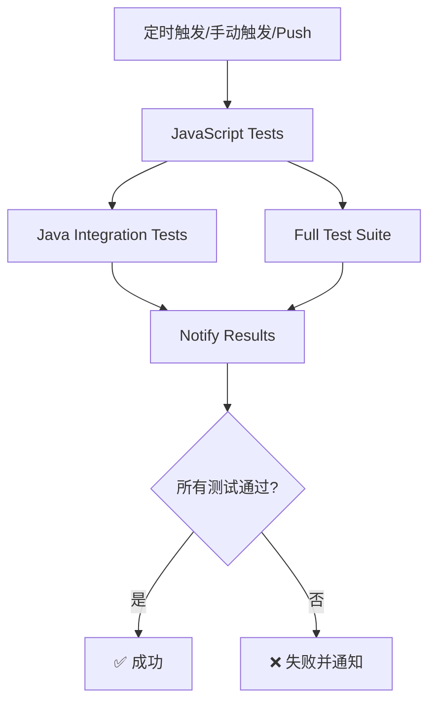

# GitHub Actions 每日全量测试

## 📋 概述

本项目配置了自动化的每日全量测试 GitHub Workflow，确保代码质量和跨平台兼容性。

## ⏰ 运行时间

- **自动运行**: 每天凌晨 2:00 (UTC) / 上午 10:00 (北京时间)
- **手动触发**: 可在 GitHub Actions 页面手动运行
- **Push 触发**: 推送到 main/master 分支时自动运行

## 🧪 测试内容

### 1. JavaScript 单元测试
- **测试数量**: 614+ 测试用例
- **运行环境**: Node.js 20.x 和 22.x
- **测试内容**:
  - SM2/SM3/SM4 算法实现
  - 加密模式（ECB/CBC/CTR/GCM/OFB/CFB）
  - 数学运算和椭圆曲线
  - 工具函数和参数类
- **代码覆盖率**: 自动生成并上传到 Codecov

### 2. Java 集成测试
- **测试数量**: 141+ 测试用例
- **运行环境**: JDK 17 和 JDK 21
- **测试内容**:
  - JavaScript ↔ Java 互操作性
  - SM2 签名/加密兼容性
  - SM4 加密解密兼容性
  - 跨语言数据一致性
- **测试框架**: JUnit 5 + GraalVM Polyglot

### 3. 完整测试套件
- **运行环境**: GraalVM 21
- **执行命令**: `npm run test:all`
- **包含内容**:
  - 所有 JavaScript 测试
  - 所有 Java 集成测试
  - 端到端测试
- **超时限制**: 30 分钟

## 📊 测试矩阵

| 测试类型 | 环境 | 测试数量 | 预期时间 |
|---------|------|---------|---------|
| JavaScript 单元测试 | Node.js 20.x | 614+ | ~3 秒 |
| JavaScript 单元测试 | Node.js 22.x | 614+ | ~3 秒 |
| Java 集成测试 | JDK 17 | 141+ | ~30 秒 |
| Java 集成测试 | JDK 21 | 141+ | ~30 秒 |
| 完整测试套件 | GraalVM 21 | 755+ | ~2 分钟 |

## 🔄 工作流程



## 📁 生成的产物

### 测试报告
- **JavaScript 覆盖率**: 上传到 Codecov
- **Java 测试结果**: Surefire 报告
- **保留时间**: 7 天

### 下载产物
在 GitHub Actions 页面可以下载：
- `java-test-results-jdk17` - JDK 17 测试结果
- `java-test-results-jdk21` - JDK 21 测试结果
- `full-test-results` - 完整测试结果和覆盖率

## 🚀 手动触发

### 通过 GitHub 网页
1. 访问仓库的 Actions 页面
2. 选择 "Daily Full Test Suite" workflow
3. 点击 "Run workflow" 按钮
4. 选择分支（默认 master）
5. 点击 "Run workflow" 确认

### 通过 GitHub CLI
```bash
gh workflow run daily-full-test.yml
```

## 🔧 配置说明

### Workflow 文件
- **位置**: `.github/workflows/daily-full-test.yml`
- **名称**: Daily Full Test Suite

### 环境变量
- `MAVEN_OPTS`: `-Xmx1024m` (限制 Maven 内存使用)

### 必需的 Secrets
- `CODECOV_TOKEN`: (可选) 用于上传覆盖率到 Codecov
- `GITHUB_TOKEN`: (自动提供) 用于 GraalVM 安装

## 📈 监控和通知

### 成功标准
- ✅ 所有 JavaScript 测试通过
- ✅ 所有 Java 集成测试通过
- ✅ 完整测试套件通过
- ✅ 没有构建错误

### 失败处理
- ❌ 任何测试失败都会标记 workflow 为失败
- 📧 GitHub 会自动发送邮件通知（如已配置）
- 🔔 可配置 Slack/Teams 等通知（需额外配置）

## 🔍 查看测试结果

### GitHub Actions 页面
1. 访问 https://github.com/lihongjie0209/sm-js-bc/actions
2. 选择 "Daily Full Test Suite" workflow
3. 查看最近的运行记录
4. 点击具体的运行查看详细日志

### 测试覆盖率
- 访问 Codecov 仪表板（如已配置）
- 查看代码覆盖率趋势
- 查看未覆盖的代码行

## 🛠️ 本地测试

在推送前可以本地运行相同的测试：

```bash
# JavaScript 测试
npm test
npm run test:coverage

# 构建项目
npm run build

# Java 测试（需要 Maven 和 JDK）
cd test/graalvm-integration/java
mvn clean test

# 完整测试套件
npm run test:all
```

## 📝 最佳实践

1. **推送前测试**: 推送到 main/master 前先运行本地测试
2. **查看报告**: 定期查看每日测试报告，及时发现问题
3. **快速修复**: 测试失败时尽快修复，避免影响其他开发
4. **保持更新**: 定期更新依赖和测试环境

## 🔗 相关链接

- [GitHub Actions 文档](https://docs.github.com/en/actions)
- [Codecov 文档](https://docs.codecov.com/)
- [GraalVM 文档](https://www.graalvm.org/latest/docs/)
- [Maven Surefire 插件](https://maven.apache.org/surefire/maven-surefire-plugin/)

## 🎯 未来改进

- [ ] 添加性能基准测试
- [ ] 集成 SonarQube 代码质量分析
- [ ] 添加浏览器兼容性测试
- [ ] 配置 Slack/Teams 通知
- [ ] 添加自动发布流程
- [ ] 添加依赖安全扫描

## 💡 故障排查

### 常见问题

**Q: 测试超时了怎么办？**
A: 检查是否有死循环或性能问题，可以增加 `timeout-minutes` 配置。

**Q: Java 测试失败但本地通过？**
A: 检查 JDK 版本差异，确保本地使用的 JDK 版本与 CI 一致。

**Q: 覆盖率上传失败？**
A: 检查 `CODECOV_TOKEN` 是否正确配置，或者设置 `continue-on-error: true`。

**Q: 如何跳过某些测试？**
A: 可以使用 Maven 的 `-DskipTests` 或 Vitest 的 `--skip` 参数。

---

最后更新: 2025-11-05
维护者: lihongjie0209
